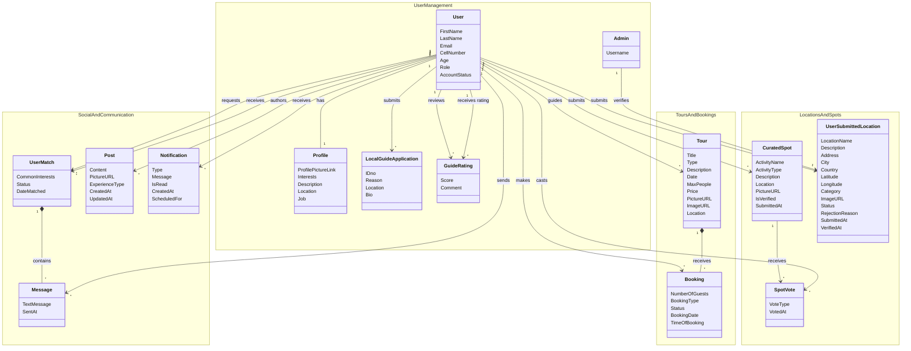

# WanderSync Domain Model

```mermaid
classDiagram
    namespace UserManagement {
        class User {
            FirstName
            LastName
            Email
            CellNumber
            Age
            Role
            AccountStatus
        }
        class Profile {
            ProfilePictureLink
            Interests
            Description
            Location
            Job
        }
        class Admin {
            Username
        }
        class LocalGuideApplication {
            IDno
            Reason
            Location
            Bio
        }
        class GuideRating {
            Score
            Comment
        }
    }

    namespace SocialAndCommunication {
        class UserMatch {
            CommonInterests
            Status
            DateMatched
        }
        class Message {
            TextMessage
            SentAt
        }
        class Post {
            Content
            PictureURL
            ExperienceType
            CreatedAt
            UpdatedAt
        }
        class Notification {
            Type
            Message
            IsRead
            CreatedAt
            ScheduledFor
        }
    }

    namespace ToursAndBookings {
        class Tour {
            Title
            Type
            Description
            Date
            MaxPeople
            Price
            PictureURL
            ImageURL
            Location
        }
        class Booking {
            NumberOfGuests
            BookingType
            Status
            BookingDate
            TimeOfBooking
        }
    }

    namespace LocationsAndSpots {
        class CuratedSpot {
            ActivityName
            ActivityType
            Description
            Location
            PictureURL
            IsVerified
            SubmittedAt
        }
        class UserSubmittedLocation {
            LocationName
            Description
            Address
            City
            Country
            Latitude
            Longitude
            Category
            ImageURL
            Status
            RejectionReason
            SubmittedAt
            VerifiedAt
        }
        class SpotVote {
            VoteType
            VotedAt
        }
    }

    %% Relationships
    User "1" -- "1" Profile : has
    User "1" --> "*" Notification : receives
    User "1" --> "*" Post : authors
    User "1" --> "*" Booking : makes
    User "1" --> "*" LocalGuideApplication : submits
    User "1" --> "*" UserSubmittedLocation : submits
    User "1" --> "*" CuratedSpot : submits
    
    User "1" --> "*" GuideRating : reviews
    User "1" --> "*" GuideRating : receives rating
    
    User "1" --> "*" UserMatch : requests
    User "1" --> "*" UserMatch : receives
    UserMatch "1" *-- "*" Message : contains
    User "1" --> "*" Message : sends
    
    User "1" --> "*" Tour : guides
    Tour "1" *-- "*" Booking : receives
    
    Admin "1" --> "*" UserSubmittedLocation : verifies
    
    CuratedSpot "1" --> "*" SpotVote : receives
    User "1" --> "*" SpotVote : casts
```
